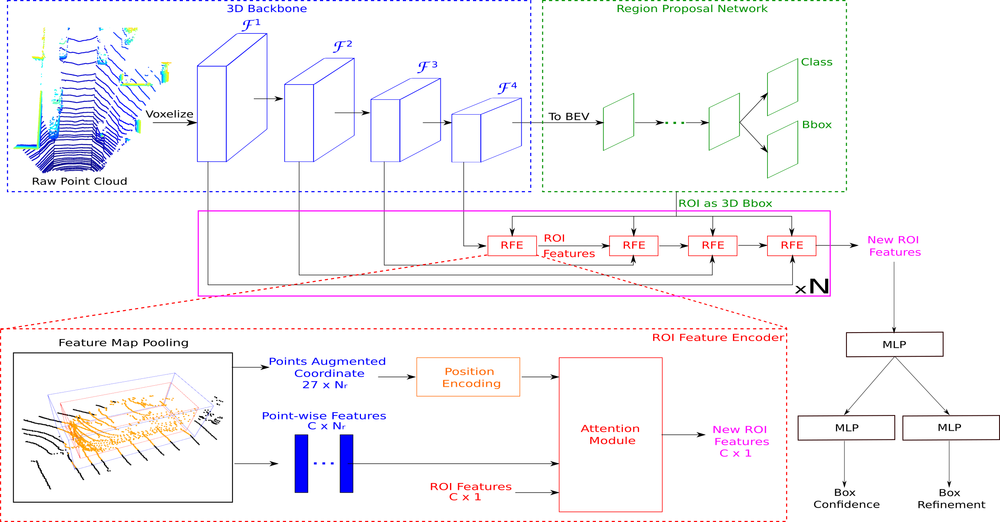
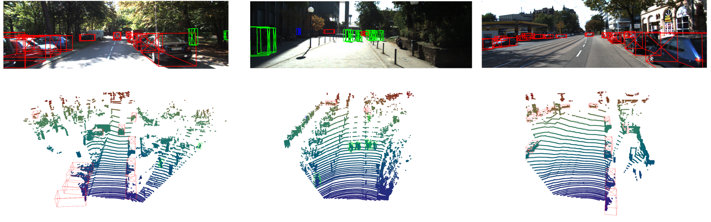
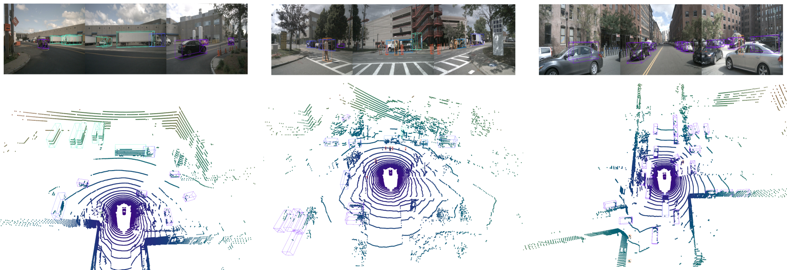

# APRO3D-Net: Attention-based Proposals Refinement for 3D Object Detection
This implementation of APRO3D-Net is based on [`OpenPCDet`](https://github.com/open-mmlab/OpenPCDet/). Our paper can be found [here](https://arxiv.org/abs/2201.07070).

<p align="center">
  
</p>
The overall architecture of APRO3D-Net. The voxelized point cloud is fed to a 3D backbone for feature extraction. The backbone’s output is then converted to a BEV representation on which an RPN is applied to generate ROI. Several ROI Feature Encoders (RFE) transform feature maps produced by backbone into ROI features by: first pooling from inputted feature maps, then encoding pooled points position, finally refining previous ROI feature using pooled features and their position encoding via Attention Module. Refined ROI feature is mapped to confidence and refinement vector by two MLP-based detection heads. Here, blue cuboids and green parallelogram respectively denote feature maps computed by 3D and 2D convolution.

Performance on KITTI *val* set
|   |   | AP@R11     |         |     | AP@R40      |          | Download  |
|------|------|------------|---------|-----|-------------|----------|-----------|
|| Car  | Pedestrian | Cyclist | Car | Pedestrian  | Cyclist  |           |
|[APRO3D-Net (kitti)](tools/cfgs/kitti_models/swh_kitti.yaml)| 83.51  | 57.45 | 72.97 | 84.84 | 57.00  | 73.35  | [kitti-model](https://uncloud.univ-nantes.fr/index.php/s/iEgNps8RRXD6YSj)

Performance on NuScenes *val* set
|| Car | Ped | Bus | Barrier | Traf. Cone | Truck | Trailer | Motor | Cons. Veh. | Bicycle | mAP | Download |
|---|---|---|---|---|---|---|---|---|---|---|---|---|
|[APRO3D-Net (nuscenes)](tools/cfg/nuscenes_models/swh_nuscenes.yaml)| 77.75 | 74.02 | 64.86 | 52.61 | 46.34 | 43.99 | 34.90 | 39.36 | 13.44 | 23.00 | 47.03 | [nuscenes-model](https://uncloud.univ-nantes.fr/index.php/s/scSYisJME9Zz6ZC) |

## Installation
To use this repo, please follow `OpenPCDet`'s intruction for [preparing datasets](https://github.com/open-mmlab/OpenPCDet/blob/master/docs/GETTING_STARTED.md) and [installation](https://github.com/open-mmlab/OpenPCDet/blob/master/docs/INSTALL.md).

## Demo
Demo requires `open3d`

```bash
pip install open3d
```

### KITTI Dataset
To visualize prediction for KITTI Dataset, 
* Download the [trained model](https://uncloud.univ-nantes.fr/index.php/s/iEgNps8RRXD6YSj)
* Execute the following command in the `tools` directory
```bash
python visualize_kitti.py --cfg_file cfgs/kitti_models/swh_kitti.yaml \
       --ckpt_file <path_to_directory_containing_ckpt>/roi100_checkpoint_epoch_91.pth --log_file_dir .
```
Example results
<p align="center">
  
</p>

### NuScenes Dataset
To visualize prediction for NuScenes Dataset
* Download the *prediction* file generated for [mini split](https://uncloud.univ-nantes.fr/index.php/s/JnmgoxpFHi6mqXN) or [test split](https://uncloud.univ-nantes.fr/index.php/s/kQe8PLSWSkzicYT)
* If the **test** split is chosen, remember of generate NuScenes database with **test** split enabled by setting the following fields in [nuscenes_dataset.yaml](tools/cfgs/dataset_configs/nuscenes_dataset.yaml)

```YAML
VERSION: 'v1.0-test'
DATA_SPLIT: {
    'train': train,
    'test': test
}
INFO_PATH: {
    'train': [nuscenes_infos_10sweeps_train.pkl],
    'test': [nuscenes_infos_10sweeps_test.pkl],
}
```
* Execute the following command in the `tools` directory
```bash
python visualize_nuscenes.py --split mini \
        --result_file <path_to_directory_containing_prediction>/results_nusc_swh_second_rfe_mini.json \
        --scene_idx 0 --render_cam_back --render_point_cloud
```
Example results
<p align="center">
  
</p>

## Test
To test pretrained model, execute the following command in the `tools` directory
```bash
python test.py --cfg_file ${CONFIG_FILE} --ckpt ${CKPT}

# e.g., 
python test.py --cfg_file tools/cfgs/kitti_models/swh_kitti.yaml \
        --ckpt <path_to_directory_containing_ckpt>/roi100_checkpoint_epoch_91.pth
```
